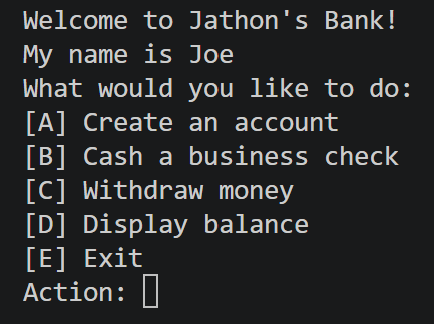

# Bank-Account-Manager

This program is a python project aiming to simulate a bank account manager. 

# How to Run

To run the program, run Main.py.

# Classes

Main.py: Where all the objects are created and where you can test the code.

Account.py: The template for all the account types. Provides basic account functions for all types.

BusinessAccount.py: This class adds additional functions unique to a business account.
SavingsAccount.py: This class adds additional functions unique to a savings account.
CheckingAccount.py: This class adds additional functions unique to a checking account.

BankingSystem.py: This class represents the object of the Bank itself. It can create workers and accounts and functions as the main hub of the project.

Worker.py: This class functions the workers in a bank. They provide the UI for the functions of the bank system.

DebitCard.py: This class functions as a debit card that is given by the CheckingAccount class. This class only provides basic functions.

# Terminal Based UI

